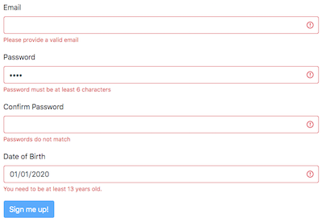

# Problem: Form Validation

In this exercise, you will practice writing JavaScript to work with DOM events. In particular, you will add functionality to support custom _client-side validation_ (checking that entries to a form are formatted correctly before they are sent to a server):

Note that to achieve this effect, you will use the [HTML5 Form Validation](https://developer.mozilla.org/en-US/docs/Learn/Forms/Form_validation) API, as well Bootstrap's [Form component](https://getbootstrap.com/docs/4.4/components/forms/#validation) styling.

To complete the exercise, edit the included **`js/index.js`** file to add in the code described in the comments. Note that you should ___not___ edit the HTML file!

You can see the results of your work either by opening up the included `index.html` file in a browser. Remember to refresh the page after you update your code, and to check for any errors in the Developer console.
