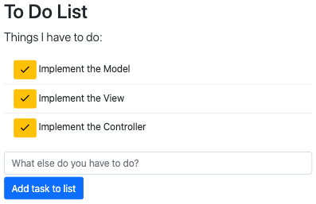

# Problem: To Do List (ES6 Modules)

In this exercise, you will practice working with ES6 modules, as well as other ES6+ syntax features. In particular, you will implement a simple interactive to-do-list app:



(In this app, you can enter text and hit "Add task to list" to add another item to the list, and hit one of the yellow checkmark buttons to mark that ask as "complete", removing it from the list. Only incomplete tasks will be shown).

In particular, you will practice using **ES6 modules** to organize this app based on the [Model, View, Controller (MVC)](https://en.wikipedia.org/wiki/Model%E2%80%93view%E2%80%93controller) architecture. This is an incredibly common structure used when developing interactive applications (such as web apps)!


## Serving the App
Using ES6 modules means that JavaScript files will need to load and reference one another. For security reasons, browsers will only let you "load" another file is your web page is being provided by a **web server**&mdash;the browser needs to load the page using the `http://` protocol, rather than the `file://` protocol, so you can't just "double-click" on the `.html` file.

Luckily, it's easy to run a simple web server using on your computer, allowing you to "serve" the files to yourself. You can do this using the [live-server](https://github.com/tapio/live-server) program:

```bash
# navigate to the problem folder (the one containing this README)
cd path/to/problem-folder

# run the live-server program. Note the . to serve the entire folder
# you MUST run the command from inside the problem folder!
npx live-server .
```

This will open up your `index.html` file in a browser (if not, you can view the page at <http://localhost:8080>). It will also _automatically_ refresh the page whenever you change a file in the folder.

You can _stop_ the server by hitting `ctrl-c` in your terminal. Note that it's common to use one terminal to run the server, and a second different terminal to run tests and commit to git.


## Exercise Instructions
To complete the exercise, you will implement code across a number of different **`.js`** files (modules) following the below instructions.

You can see the results of your work in the `index.html` file loaded by your local web server. Remember to check for any errors in the Developer console.


1. Begin by adding a `<script>` element to the `index.html` file in order to include the `js/index.js` script (the "launching" module) in your page. To load this as a _module_, the script element needs a `type="module"` attribute. This should cause the script's logged message to appear in the Developer Console; if you see an error, check that you're opening the page via your web server.

    - Throughout this exercise, you can test your work by _temporarily_ importing a particular module script your `index.js` file. For example, you can import the `Model.js` module using `import './Model.js'` (using the relative path to the module to import). The first time a module is imported it will be executed, so any code in that script (including function calls and console.logs) will be run, and you can see the output in the browser's Developer Console.

    - You will need to debug this application **in the browser** by acting as a _user_ (clicking buttons on the page) and looking at console.log messages generated from your script. Because modules keep values private, you will not be able to "run code" from the Developer Console. 

2. The first module you'll complete is **`js/Model.js`**, which will manage the Model. The **Model** in an MVC program represents the "data" or "information" in the program. It handles access to the underlying data structure (e.g., the array, object, or database). In this exercise, your Model track and control the list of tasks to do.

    - Start by declaring that the script should be run in _strict mode_. You should do this for _every_ JavaScript file you create!

    - The Model module should begin by _importing_ some initial task data from the included `./task-data.js` file. Import the data as a **default import**, assigning it a local variable (e.g., `initialTasks`). This data is an array of objects, each object representing a task to do. You can try logging out the variable to see what it looks like.

        Note that the `task-data.js` file is itself another module that exports the data value. In the future you'll be able to import `.json` files directly using this exact same syntax.

    - It is the Model's responsibility to make sure the data is in a useful "format". Use the **`.map()`** method to map this data to a new variable (e.g., `currentTaskList`) that is also an array of objects, but where each object has an additional `id` property giving that task a unique id number. The first task will be id `1`, the second will be id `2`, etc. Use an _arrow function_ for the callback function (specify the map callback's second argument `index` to keep track of the index). Use the _spread operator_ (`...`) to copy the object with the additional property included. This is good ES6+ syntax practice!

    - Define and `export` a function named **`getIncompleteTasks()`** that returns an array of all tasks whose `status` is `"incomplete"`. Use the `.filter()` function to do this, with a _concise body arrow function_ as a callback.

        You can test this function by calling it and logging out the returned result. You should get an array of 3 task objects (all of which will have ids!). Be careful that you're not "deleting" the complete items; they should still be in the list!
    
    - Define and `export` a function named **`addTask()`**. This function will expect a string as an argument (the task description). The function should then create a new task object, whose `description` is the argument value, `status` is `"incomplete"`, and `id` is 1 higher than the id of the last task in the list. The function should then add this new task object to the existing `currentTaskList`. Again use the _spread operator_ (`...`) to copy the array with the additional element included&mdash;you are replacing the previous `currentTaskList` value with a new, longer array.

    - Define and `export` a function named **`markComplete()`**. This function will expect a single number as an argument (the task id). The function will then modify the `currentTaskList`, changing the task with the given id so it's status becomes `"complete"`. Because it is best practice to make operations like this "pure" (without introducing side effects), your function will use the `.map()` method to create a "copy" of the current task list, and then assign that copy to the global variable. In your `.map()` callback, create a copy of that object (use the _spread operator_ again). Then _if_ that copy has the same `id` as the argument, change the `status` of that copy. Then return the copy to be added into the mapped array. Finally, assign the result of the `.map()` function to the `currentTaskList` variable.

        You can test these functions by calling them and then logging out the new `currentTaskList` variable and visually confirming the changes.


3. The next module to complete is **`js/View.js`**, which represents the View. The **View** is a (visual) presentation of the Model; it is what the user perceives. Note that an application can have multiple Views of a single Model (e.g., you can show a Model as both a data table and as a chart). In this exercise, your View will be responsible for creating the DOM to be rendered.

    - Remember the script should run in _strict mode_!

    - The View can "read" from the Model (though not modify it!). In your view, `import` just the `getIncompleteTasks()` function from the model. You can call this function to get the data to render.

    - Define but _do not export_ a function named **`renderSingleTask()`** (this is a "helper" function so can remain private). This function will expect _two_ arguments: a "task object" (like in the model's array), and a _callback function_ (e.g., `markCompleteCallback`) that will be executed when the "done" button is clicked. The function will create _and return_ a new `<li>` element with the following properties and content:
        - The `<li>` has a class of `list-group-item`.
        - The `<li>` has text content that is a blank space (`" "`) followed by the `description` of the task object. The space is for spacing.
        - The list item will include a `<button>` element. The button has:
            - The classes `btn`, `btn-sm`, and `btn-warning`.
            - HTML content of `<span class="material-icons-outlined">done</span>` (the checkmark)
            - An event listener for `click` events; on such an event: execute the `markCompleteCallback`, passing in the task object. Note that you can't just pass the `markCompleteCallback` as an argument to `addEventListener()`. Instead, you will need to add a "listener callback", and then _that function_ will call `markCompleteCallback()` pass in the appropriate value. Use an arrow function for the `addEventListener()` listener callback. Remember that the "listener callback" will be passed an `event` as a parameter, but since you aren't using that you can leave the parameter list empty `()` if you wish.
            - Include the button as the _first element_ of the `<li>` (before the text); the `prepend()` method will help.

        Remember to _return_ the `<li>` element!

        You can test this function in the browser by calling it from your script, passing in an element from calling the model's `getIncompleteTasks()` function and `undefined` for the `markCompleteCallback` (for now). Then log out the returned DOM to see that it looks correct. The `index.html` file has a (commented out) example of what the DOM should be.

    - Define and `export` a function named **`renderTaskList()`**, which will render and return a DOM list of ALL of the tasks. This function expects a single argument, a callback function (e.g., the `markCompleteCallback`). The function will create a new `<ul>` element with the `list-group` and `list-group-flush` classes. It will call the `getIncompleteTasks()` function from the model. Then for each element in the results, it will call `renderSingleTask()` (passing in that object and the argument callback), and append the returned `<li>` to the the `<ul>`. In the end it will return the `<ul>` element.

        Optionally, if there are no incomplete tasks, it can return a `<div>` with a simple message (e.g., "None!") instead of the `<ul>`.

        You can continue to test this function by calling it from your script, passing in `undefined` for the `markCompleteCallback`, and logging out the returned result. You can also _temporarily_ append the returned value to the DOM's `#task-root` element to see if it shows up correctly.


4. The last module to complete is **`js/Controller.js`**&mdash;the controller. The **Controller** facilitates communication between the Model and the View and traditionally handles user interaction. The Controller tells the Model to change the data in response to user input, and then tells the View to "update" itself to reflect the changed Model. In this exercise, your control will all use input callbacks.

    - This module will need to `import` functions from both the `Model` and the `View` modules. Use `import *` syntax to import all the functions from the Model (so you will refer to them as e.g., `model.addTask()`), and a _named import_ to import the `renderTaskList` function from the View.

    - Define but _do not export_ a function named **`markCompleteCallback`**, which will be the helper function that will be called when a "done" button is pressed. This function will expect as an argument a task object (like used in the Model). When called, the function will call the model's `markComplete()` function, passing in that task object's `id`. It will then call the `renderTaskView()` function defined in the next step to "refresh" the page's content.

    - Define and `export` a function named **`renderTaskView()`**. This function will tell the View to "re-render" itself (recreate the DOM), and then make sure that DOM is shown in the browser in the correct spot. (This is a controller function because it needs to specify the mark completed callback). The function will do the following:
        - Remove all current content from the `#tasks-root` div; do this by setting the `innerHTML` to an empty string (`""`).
        - Call the View's `renderTaskList()` function, passing in the `markCompleteCallback`.
        - Append the returned element to the `#tasks-root` div.

        You can test this function by calling it from your script and seeing if the rendered content shows up correctly. See Step 5 below.

    - Additionally, the Controller will handle the input form (including some minor form validation). You don't need a separate function for this; you can just set up the event handling in the script. Add a `click` event listener to the `#add-task-button` button. In the listener's callback, you should do the following:
        - Get the `value` property of the `<input>` element (what the user has typed in).
        - If that value is an empty string, do nothing&mdash;the controller makes sure the Model doesn't try to add empty tasks!
        - Otherwise, call the Model's `addTask()` function, passing in the inputted value.
        - After the function calls `addTask()`, it should clear the inputted value (set the element's `value` property to an empty string), and then call `renderTaskView()` to "rerender" the list!


5. Finally, modify the `js/index.js` module so that it _just_ imports the Controller's `renderTaskView()` function, and then calls that function to initially render the list. This will cause the Controller to set up the Model and the Views, hook them all together, and handle user input&mdash;giving you a working task list app!
